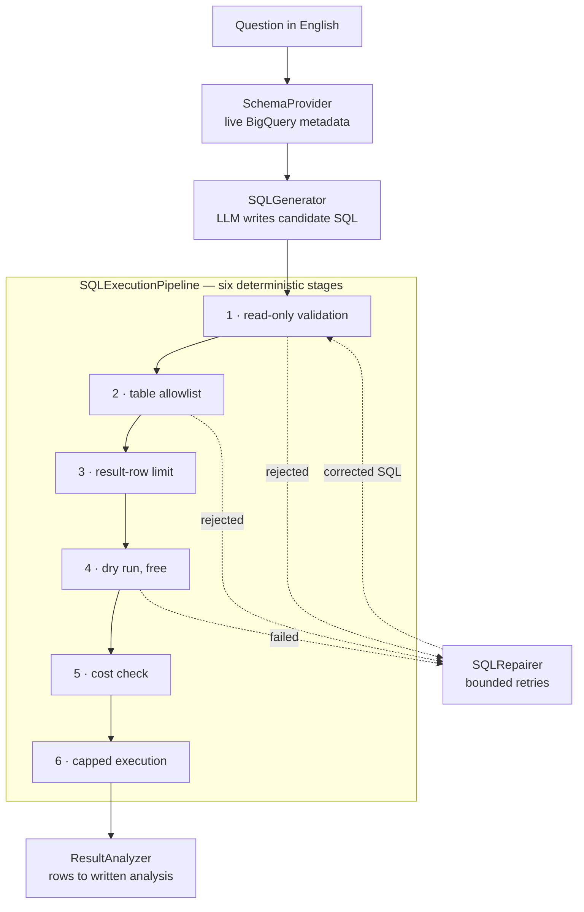

# BigQuery SQL Agent


Ask a business question in plain English. Get back a validated, cost-capped, read-only BigQuery query, the rows it returned, and a written analysis of what they mean.

A local LLM writes the SQL. Deterministic Python decides whether that SQL is ever allowed to run: six guardrail stages — read-only check, table allowlist, row limit, dry run, cost check, capped execution — sit between the model and the warehouse, and nothing reaches BigQuery until all six pass. **160 offline tests** cover those stages, including the adversarial cases, and run on a fresh clone with no cloud account, no credentials and no LLM server.

Python 3.11 · Google BigQuery · sqlglot · Ollama (Gemma) · LangChain tools · pytest

> **One of three portfolio projects on applied AI for analytics.**
> **BigQuery SQL Agent** (this repo) · [SQL Analyst Agent](https://github.com/vk4868/sql-analyst-agent) — a LangGraph agent over a read-only database, with tools served over MCP · [RAG Document QA](https://github.com/vk4868/rag-document-qa) — cited answers over a PDF corpus, with a measured evaluation harness.

---

## Overview

This is a natural-language-to-SQL agent for Google BigQuery. The interesting part is not the text-to-SQL — it is everything around it. The model is treated as untrusted. It only ever produces *text*, and that text has to survive a six-stage guardrail pipeline before a single byte is scanned. When a query is rejected, the rejection message is fed back to the model, which gets a bounded number of attempts to fix it.

Every run leaves an audit trail: a human-readable log line and a structured JSONL record with per-stage timings.

---

## Business problem

In most companies, the people who need data and the people who can query it are not the same people.

A category manager wants to know whether the notebook range is still declining. A finance lead wants margin by branch for the last quarter. Neither writes SQL, so the question goes into a queue. An analyst turns it into a query, runs it, pastes the numbers back. The round trip takes hours or days, and the decision has often already been made by the time the answer arrives.

The obvious fix — "let an LLM write the SQL" — creates three new problems that stop it being used on real data:

| Risk | What it looks like in practice |
|---|---|
| **Damage** | A model that can emit `DELETE`, `DROP` or `MERGE` against a production warehouse. |
| **Cost** | BigQuery bills by bytes scanned. One unbounded `SELECT *` over a large partitioned table is a real, unpleasant invoice. |
| **Wrong answers stated confidently** | A hallucinated column name is caught by the warehouse. A hallucinated *interpretation* of correct numbers is not. |

This project exists to answer the follow-up question asked in every interview about text-to-SQL: **how do you stop it doing something stupid or expensive?**

---

## What the guardrails do

> **On the outputs in this section.** The SQL and the rejection messages are real output produced by the guardrail code and asserted in the test suite. The analysis block is the output template the prompt enforces, not a captured model response — no live agent transcript is published here. The GCP project identifier has been replaced with `your-project-id` throughout.

### A hostile query

These are the exact rejection messages the code produces. None of them execute, and none of them bill anything — the first four are rejected before BigQuery is contacted at all, and the cost rejection is based on a dry run, which BigQuery performs for free.

| Input | Outcome |
|---|---|
| `DELETE FROM \`…fact_sales\` WHERE sale_date < '2025-01-01'` | rejected at `validation` — *"Only read-only query statements are allowed. Received: Delete."* |
| `SELECT 1; DROP TABLE \`…fact_sales\`` | rejected at `validation` — *"Must contain exactly one statement, but found 2"* |
| `SELECT * FROM \`bigquery-public-data.thelook_ecommerce.orders\`` | rejected at `table_access` — *"Project 'bigquery-public-data' is not allowed. Only project 'your-project-id' may be queried."* |
| `SELECT … LIMIT @row_limit` | rejected at `result_limit` — *"LIMIT must be a fixed integer value…"* |
| A query estimated at 500 MB | rejected at `cost_check` — *"Query exceeds the configured processing limit."* |

Because `sqlglot` parses the statement into an abstract syntax tree, the checks survive things a regex would miss: a foreign table hidden inside a scalar subquery, a `LIMIT` that is a parameter rather than a number, a CTE alias that only looks like a table name, `UNNEST` that is not a table at all.

### A legitimate query

Given a candidate query for *"What were total net sales by month in 2025?"*, stages 1–3 normalise it, confirm the table is allowlisted and append the row limit. This is the actual output of those stages:

```sql
SELECT
  FORMAT_DATE('%Y-%m', sale_date) AS sales_month,
  SUM(net_revenue) AS total_net_sales
FROM `your-project-id.business_insights.fact_sales`
WHERE
  sale_date >= CAST('2025-01-01' AS DATE)
  AND sale_date < CAST('2026-01-01' AS DATE)
GROUP BY sales_month
ORDER BY sales_month
LIMIT 100
```

The result carries the decision trail:

```python
{
  "status": "success",
  "stage": "execution",
  "referenced_tables": ["your-project-id.business_insights.fact_sales"],
  "result_limit_message": "Added a maximum result limit of 100 rows",
  "limit_was_modified": True,
  "stage_timings_ms": {"read_only_validation": ..., "table_access_validation": ..., ...},
  "rows": [...],
}
```

### The analysis contract

`ResultAnalyzer` requires the model to answer in a fixed structure and to declare its own limitations. The prompt forbids inventing numbers and claiming causation, and requires truncation to be stated:

```
DIRECT ANSWER:      <a direct response to the business question>
KEY INSIGHTS:       <two to four observations, each supported by the returned rows>
SUPPORTING NUMBERS: <the specific figures the answer rests on>
LIMITATIONS:        <e.g. "Analysis is based on the first 50 of 1,260 rows.">
SUGGESTED FOLLOW-UP:<one useful next question>
```

---

## How it works



The system is split in two, and only one half is trusted. **The non-deterministic half** — the LLM — converts language to SQL, and rows to prose. It is guided by strict prompts but never relied on for safety. **The deterministic half** — parser-based guardrails plus a thin BigQuery service — decides what actually runs. The prompt *asks* for safe SQL; the guardrails *enforce* it regardless of what comes back.

Stage by stage: the SQL must parse, be exactly one statement and be a query; every physical table must be fully qualified and allowlisted (CTE aliases are recognised and skipped); a missing `LIMIT` is injected, an oversized one reduced, a non-integer one rejected; a free dry run validates and prices the query, which is where a hallucinated column is caught; anything over `MAX_QUERY_BYTES` is refused; execution carries `maximum_bytes_billed`, a job timeout and a client-side row cap.

A rejection at stages 1, 2 or 4 goes back to the model as a repair prompt with the original question and the live schema, up to `MAX_SQL_REPAIR_ATTEMPTS` times. Failures that rewriting SQL cannot fix — a timeout, a warehouse error — are deliberately not retried.

Three orchestration layers, each usable on its own:

| Layer | Class | Does |
|---|---|---|
| Execution | `SQLExecutionPipeline` | Takes SQL from anywhere. Runs the six stages. Never raises — always returns `{status, stage, ...}`. |
| Question | `QuestionToSQLPipeline` | Question → schema → SQL → execution, with the repair loop. |
| Insights | `QuestionToInsightsPipeline` | The above, plus a grounded written analysis of the rows. |

For a line-by-line walkthrough of one request, see **[PIPELINE.md](PIPELINE.md)**.

### Tech stack

| Concern | Choice | Why |
|---|---|---|
| Warehouse | Google BigQuery | Dry runs and `maximum_bytes_billed` make cost control a first-class feature. Auth is Application Default Credentials, so no service-account key is committed or required. |
| SQL parsing | `sqlglot` | The guardrails walk a real AST. String matching on "DROP" is not a security control. |
| LLM | Ollama + Gemma, running locally | No data leaves the machine, no per-token cost, reproducible for anyone cloning the repo. |
| Tool interface | `langchain` | Used only for the `@tool` decorator on `get_schema` and `run_sql`. `langgraph` arrives as a transitive dependency and is deliberately unused — the orchestration is plain Python, so the control flow stays explicit and testable. |
| Observability | stdlib `logging` + JSONL | Human log for reading, JSONL for querying; every setting is env-overridable via `python-dotenv`. |

---

## Installation and setup

Requires Python 3.11+.

```bash
git clone https://github.com/vk4868/bigquery-sql-agent.git
cd bigquery-sql-agent

python -m venv .venv
source .venv/bin/activate        # Windows: .venv\Scripts\activate

pip install -r requirements.txt
pytest                           # runs immediately: no cloud account, no LLM
```

Everything below is needed only to run against real data. Every setting has a working default, so `.env` is optional — copy `.env.example` to `.env` and change what you need. Real environment variables take precedence over `.env`.

| Setting | Default | Role |
|---|---|---|
| `GCP_PROJECT_ID` | `your-project-id` | The only project the allowlist permits. Set this to your own project. |
| `BIGQUERY_DATASET_ID` | `business_insights` | The only dataset that may be queried. |
| `MAX_QUERY_BYTES` | `100000000` (100 MB) | **Cost cap** — dry-run rejection and `maximum_bytes_billed`. |
| `MAX_RESULT_ROWS` | `100` | **Row cap** — `LIMIT` injected/reduced, plus a client-side cap. |
| `QUERY_TIMEOUT_SECONDS` | `30` | **Time cap** — job cancelled on expiry. |
| `MAX_SQL_REPAIR_ATTEMPTS` | `2` | How many times the LLM may fix rejected SQL. `0` disables repair. |

`BIGQUERY_LOCATION`, `MAX_ANALYSIS_ROWS`, `OLLAMA_MODEL` and the logging paths are documented in `.env.example`.

```bash
gcloud auth application-default login
ollama pull gemma3:4b && ollama serve

python scripts/manual/check_bigquery_connection.py   # lists the tables it can see
python scripts/manual/check_ollama_connection.py
```

`Datasets/` contains the complete synthetic `business_insights` star schema as CSVs (1,500 rows across `fact_sales`, `dim_customers`, `dim_products`), with the full spec in `Datasets/DATA_DICTIONARY.md`. Create a dataset of that name in your project and load the three CSVs into matching table names.

---

## Usage

```python
from src.bigquery_service import BigQueryService
from src.llm.ollama_client import OllamaGemmaClient
from src.question_to_sql_pipeline import QuestionToSQLPipeline
from src.schema_config import RELATIONSHIPS
from src.schema_provider import SchemaProvider
from src.sql_execution_pipeline import SQLExecutionPipeline
from src.sql_generator import SQLGenerator
from src.sql_repairer import SQLRepairer

bigquery_service = BigQueryService()
llm = OllamaGemmaClient()

pipeline = QuestionToSQLPipeline(
    schema_provider=SchemaProvider(
        bigquery_service=bigquery_service, relationships=RELATIONSHIPS
    ),
    sql_generator=SQLGenerator(llm=llm),
    sql_execution_pipeline=SQLExecutionPipeline(bigquery_service=bigquery_service),
    sql_repairer=SQLRepairer(llm=llm),
)

result = pipeline.run("What were total net sales by month in 2025?")
print(result["status"])        # success | rejected | error
print(result["final_sql"])
print(result["sql_execution"]["rows"])
```

Run SQL straight through the guardrails, bypassing the LLM:

```python
from src.tools import run_sql

run_sql.invoke({"sql": "SELECT COUNT(*) FROM `p.d.fact_sales`"})
```

The dataset supports questions like *"Which product categories grew fastest in the second half of the year?"* and *"Do members spend more per order than non-members?"*

`scripts/manual/` holds runnable end-to-end demos — `run_question_to_sql.py`, `run_question_to_insights.py` and `run_sql_repair_demo.py`, which forces a broken query through the repair loop. Each needs live credentials and Ollama.

---

## Testing

```bash
pytest
```

```
160 passed
```

The suite runs with **no Google Cloud credentials, no network access and no LLM server**. A stub BigQuery service and a scripted LLM client stand in for both, so behaviour is asserted rather than eyeballed, and nothing in the suite can create a billable job. GitHub Actions runs it on every push and pull request.

| Area | Tests | What is asserted |
|---|---|---|
| Read-only guardrail | 23 | Every DML/DDL verb rejected, stacked statements rejected, comment-hidden `DROP` inert, valid `SELECT`/CTE/`UNION` accepted. |
| Table allowlist | 19 | Foreign project, foreign dataset, unknown table, unqualified name, `INFORMATION_SCHEMA` and wildcards rejected — including a foreign table hidden in a scalar subquery or CTE. |
| Result limit | 13 | Missing `LIMIT` injected, oversized reduced, `LIMIT @param` and `LIMIT 10+10` rejected, subquery-only limits still bounded. |
| Execution pipeline | 19 | Each stage returns the right `{status, stage, error_type}`; caps reach BigQuery; timings recorded in order; one JSONL record per outcome; never raises. |
| Question and insights pipelines | 23 | The repair loop end to end — rejection → repair → success, budget exhausted, repair disabled, dry-run failures repairable, execution failures deliberately not. |
| Service, schema and analysis | 29 | Metadata mapping, partition and clustering reporting, schema rendering, row truncation, grounding rules present in the prompt. |
| Cleaning, observability and config | 34 | Code fences stripped; JSONL appended; `.env` values reach the config and real environment variables win; importing any module constructs no BigQuery client. |

`scripts/manual/` holds the live demos, excluded from pytest (`testpaths = ["tests"]`) precisely because they create real BigQuery jobs.

---

## Skills demonstrated

**Business analysis** — framing the analyst-queue problem before proposing a technical answer; specifying the cost, safety and correctness constraints that decide whether an LLM may touch a warehouse at all; documenting a star schema with stated grain, keys and financial formulas in `Datasets/DATA_DICTIONARY.md`.

**SQL and analytics** — AST-level analysis with `sqlglot`, dialect-aware normalisation, safe `LIMIT` injection, CTE and subquery handling, and the join semantics of a fact/dimension model.

**Data quality and governance** — a project/dataset/table allowlist enforced in code; read-only enforcement that survives adversarial input; bounded cost, rows and wall-clock time on every path; a structured audit record per run with per-stage timings.

**Stakeholder communication** — an analysis contract that separates the direct answer from the supporting numbers, names the figures it used and declares when it has seen only a truncated sample; documentation that states plainly what the project does not do.

**LLM engineering** — prompt design with explicit, testable rules; schema grounding from live metadata to suppress hallucinated columns; a protocol-based client abstraction that makes the model swappable; an error-driven repair loop with an explicit budget and an explicit list of what is worth retrying.

**Software engineering** — dependency injection throughout; layered pipelines each independently usable; structured error handling that never raises at the boundary; lazy construction to keep imports side-effect free; 160 tests that need no external services, wired into CI.

---

## Known limitations and what's next

- **One dataset, by design.** The allowlist permits exactly one project and one dataset. Multi-dataset use needs the allowlist and the schema document extended — both are single, well-isolated changes.
- **Single-shot, with no memory.** Each question is independent, so follow-ups do not work. The tool surface (`get_schema`, `run_sql`) already exists, so the next step is a graph-based agent loop that decides *when* to look at the schema and can ask a clarifying question.
- **Repair is bounded and blind to semantics.** The loop fixes queries that *fail*; it cannot detect a query that runs successfully and answers the wrong question. The remedy is semantic validation — checking, for example, that the requested date range actually appears in the `WHERE` clause.
- **Small dataset.** 1,500 synthetic rows keep the project free to run and reproducible. The architecture — partition pruning hints, dry runs, byte caps — is built for far larger tables but has not been exercised at that scale.
- **No live BigQuery test in CI.** Deliberate, so the suite can never bill anyone; the warehouse integration is covered by the manual scripts instead. A scheduled job against a scratch dataset would close the gap without putting billing in the pull-request path.

Also queued: result caching on the normalised SQL hash, and loading `runs.jsonl` into BigQuery to track rejection rates by stage, repair success rate and p95 latency.

---

## Licence

MIT — see [LICENSE](LICENSE). The dataset in `Datasets/` is synthetic and safe to publish.

---

## Author

**Vineet Kumar** — Melbourne, Australia.

Master of Business Analytics (Specialisation in Artificial Intelligence), Deakin University, July 2026. Previously Technical Analyst at Country Delight, analysing operational sensor data from across India in SQL, Excel and Tableau, mapping business workflows and writing BRDs with cross-functional teams. Australian work rights (Temporary Graduate visa, subclass 485).

Open to Business Analyst, Data Analyst, AI Analyst, AI Automation Analyst and Analytics Consultant roles.

- LinkedIn — <https://www.linkedin.com/in/vineetkumar->
- [BigQuery SQL Agent](https://github.com/vk4868/bigquery-sql-agent) — natural language to guarded BigQuery SQL
- [SQL Analyst Agent](https://github.com/vk4868/sql-analyst-agent) — a LangGraph agent over a read-only database
- [RAG Document QA](https://github.com/vk4868/rag-document-qa) — cited answers over a PDF corpus
