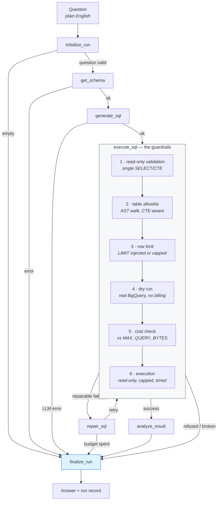

# SQL BigQuery Agent

Ask a business question in plain English. The agent grounds itself in the **live** BigQuery schema, has a local LLM write BigQuery SQL, proves that SQL safe through a six-stage deterministic pipeline before anything runs, executes it read-only under hard cost/row/time caps, and turns the rows into a written business analysis — then **checks that analysis against the data it claims to describe**.

```
$ uv run python main.py "What were total net sales by month in 2025?" --trace

SQL
  SELECT FORMAT_DATE('%Y-%m', sale_date) AS sales_month,
         SUM(net_revenue) AS total_net_sales
  FROM `sql-bigquery-502206.business_insights.fact_sales`
  WHERE sale_date BETWEEN DATE('2025-01-01') AND DATE('2025-12-31')
  GROUP BY sales_month ORDER BY sales_month

RESULT
  sales_month  total_net_sales
  -----------  ---------------
  2025-01      1462.66
  2025-02      1189.28
  ... 10 more row(s)

DIRECT ANSWER:
Total net sales for 2025 ranged from a low of $1,189.28 in February to a
peak of $2,958.02 in December...

TRACE     get_schema 3001ms · generate_sql 6541ms · execute_sql 4584ms · analyze_result 18833ms
────────────────────────────────────────────────────────────────────────
repairs 0 | rows 12 | bytes 0 | tokens 3,052 | 33.0s
```

---

## The idea

**The LLM is untrusted. It only ever emits text. Deterministic code must prove that text safe before anything happens.**

That principle is easy to state for SQL and most projects stop there. This one applies it twice:

- **To the SQL** — parsed to an AST, checked against an allowlist, bounded, dry-run costed, and only then executed read-only.
- **To the prose** — every figure in the written analysis is checked against the figures the query actually returned.

The second half is where it earns its keep. On this dataset the model writes **correct SQL 93% of the time** but makes arithmetic errors in its written summaries regularly — including, in one live run, a quarterly total off by **$1,000** while printing the correct addends beside it. No prompt fixes that. Only verification catches it.

---

## Architecture



Two halves, deliberately separated:

| | Non-deterministic | Deterministic |
|---|---|---|
| **Does** | turns language into SQL, rows into prose | parses, validates, bounds, executes, verifies |
| **Guided by** | strict prompts | sqlglot AST checks, BigQuery dry runs, arithmetic |
| **Trusted?** | no | yes |

The prompts and the guardrails overlap on purpose. The prompt *asks* for a single fully-qualified read-only query; the guardrails *enforce* it regardless of what comes back.

---

## The guardrails

Every query — model-written or hand-passed — goes through `SQLExecutionPipeline.execute()`. Nothing runs until stages 1–5 pass.

| # | Stage | Rejects |
|---|---|---|
| 1 | Read-only validation | empty, unparseable, more than one statement, anything that isn't a `SELECT`/CTE |
| 2 | Table allowlist | any table not fully qualified `project.dataset.table`, outside the configured project/dataset, or unknown. CTE names are recognised and skipped |
| 3 | Result-row limit | injects `LIMIT`, reduces one that's too high, **refuses** a parameterised one it cannot reason about |
| 4 | Dry run | whatever BigQuery itself rejects — a hallucinated column, a type error. Costs nothing |
| 5 | Cost check | estimate above `MAX_QUERY_BYTES` |
| 6 | Execution | runs read-only with `maximum_bytes_billed` and `job_timeout_ms`; a timeout cancels the job |

Stages 5 and 6 double up (estimate *and* a hard billing cap), as do 3 and 6 (injected `LIMIT` *and* a client-side cap). If the estimate is wrong, BigQuery aborts rather than over-bill.

**19 adversarial queries are pinned as a regression suite** — DML, DDL, stacked statements, foreign projects, unqualified names, a foreign table hidden in a subquery, a CTE shadowing an allowed table, a parameterised `LIMIT`. All 19 are refused **before a byte of table data is scanned**: no dry run, no execution, nothing billed.

To be precise about what does happen — stage 1 is pure parsing and touches nothing; stage 2 makes one `list_tables` **catalog** call to build the allowlist, which reads metadata rather than table data and is not billed. Every case asserts that neither the dry run nor execution was reached.

```
Guardrails: 19/19 adversarial queries refused
  validation 11 · table_access 7 · result_limit 1
```

---

## Checking the prose

`src/analysis_guard.py` extracts every figure from the written analysis and checks it against the result. A figure is grounded when it is:

- present in a returned row
- a **bounded derivation** — a column aggregate, a contiguous subtotal (what a quarter total is), a difference between two values, a share of the column total, a fraction restated as a percentage, or the row count
- a number the **question** contained

The generated SQL is deliberately *not* used as context. It is the same untrusted model output being checked, so grounding the prose in it would let a model launder a fabrication by writing the number into its own `WHERE` clause first.

Only the claim-bearing sections are checked. `LIMITATIONS` and `SUGGESTED FOLLOW-UP` are asked by the prompt to discuss data that is *not* in the result, so figures there are proposals rather than assertions.

What it caught in live runs, each verified by hand against BigQuery:


| Model claimed | Actual | Error |
|---|---|---|
| Q4 total $8,637.64 | $7,637.64 | **$1,000.00** |
| Year total $24,790.65 | $24,800.65 | $10.00 |
| Top-3 units 2,209 | 2,199 | 10 |
| Total units 2,890 | 3,300 | 410 |
| Online "≈48% of" Click-and-Collect | ratio is 223%, inverse 45% | matches neither |
| Northeast − West 169.83 | 168.83 | $1.00 |

The last row is a different kind of failure: the model wrote a comparative sentence whose number matches no ratio in the data. The guard cannot tell you *which* claim is wrong — only that the figure is not derivable.

The reader sees this directly:

```
⚠ NOT DERIVABLE FROM THE RESULT: $24,790.65
  These figures are not in the returned rows, nor a subtotal or aggregate of them.
```

---

## Evaluation

15 golden questions, each with hand-written reference SQL, scored **deterministically with no LLM judge**. The central metric is *execution accuracy*: run the agent's query and the reference query, compare the **result sets by value** — ignoring column names and column order, so the agent may phrase the query however it likes. This is the standard Spider/BIRD metric, and unlike a judge it is reproducible.

Against `gemma4:latest` (a 9.6 GB local model):

| Metric | Result | What it proves |
|---|---|---|
| `guardrail_pass` | 15/15 (100%) | never refused by its own safety layer |
| `executed` | 15/15 (100%) | always produced a result |
| `table_grounding` | 15/15 (100%) | used the expected tables |
| **`execution_accuracy`** | **14/15 (93%)** | result set matches the reference query |
| `repair_efficiency` | 15/15 (100%) | stayed within the repair budget |
| **`analysis_grounding`** | **12/15 (80%)** | every figure in the prose is derivable |
| **Overall** | **11/15 (73%)** | passed *every* metric |

Cost and latency: **21.0s mean** per question (p95 25.2s), **2,404 tokens** mean, 0 of 15 needing a repair.

The gap between 93% and 80% is the finding: **SQL generation is strong, prose arithmetic is not.**

```bash
uv run python -m evaluation.run_evaluation --fail-under 0.7   # exits non-zero on regression
uv run python -m evaluation.run_evaluation --guardrails-only  # no LLM, ~1s
```

---

## Observability

Every run appends one JSON line to `logs/runs.jsonl`, built by a pure function over the final graph state and versioned so old records stay interpretable:

```
graph_run_id  c3e4505a-…
governance    project, dataset, model, and every cap in force
outcome       success | rejected | error, terminal stage
sql           generated, final, tables, repair history
data / cost   rows, bytes estimated / processed / billed, cache hit
runtime       total, per-node trace, per-stage timings, linked execution ids
tokens        per call and rolled up
analysis      contract violations, ungrounded figures
```

A guardrail refusal is recorded as **`rejected`**, not `error` — the system worked and declined the query, which is a different outcome from something breaking.

Raw prompts, raw model output and result rows are deliberately excluded: the first two dominate record size, and rows are the caller's data.

```bash
uv run python scripts/report_runs.py
```

```
TIME BY NODE (s, mean)
  analyze_result       15.5   n=71
  generate_sql          3.4   n=71
  execute_sql           1.9   n=71
  get_schema            1.0   n=71
```

Writing the analysis is **~71% of a 21.8s mean run** — not the SQL work. If this needed to be faster, that is the only lever that matters. (These figures move as runs accumulate; re-run the script rather than trusting the paste.)

---

## Limitations

Stated plainly, because a portfolio project that only lists strengths is not worth reading.

**The grounding guard checks values, not attributions.** It can prove that 87.3% exists somewhere in the result; it cannot prove the model attached it to the right row. "Online is over 80% of revenue" passes when Online is 28% but In-Store plus Online is 87% — the figure is real, the sentence is wrong. Catching that requires parsing the claim, not the number.

**It is blind below `SMALL_INTEGER_CEILING`.** Bare whole numbers of 12 or less are skipped as structural — "three points stand out", "Q4", "the top 5" — so a fabricated *bare* small integer passes unchecked. A figure carrying a unit is always checked, so "8%" and "$8" are not exempt, but "we lost 7 accounts" is. Sampling against this dataset's real result shapes put false acceptance near 0% for decimal currency and around 1% for the count magnitudes it actually produces; the ceiling is the hole, not integers in general.

**Ratios and subset means are not enumerated**, so a model computing "4.5 times greater" is reported. Over-reporting rather than silence is the deliberate bias, but it is still noise.

**A flag means "not mechanically derivable", not "false."** It is a prompt to check, not proof of a lie.

**The evaluation set is 15 questions over one small synthetic dataset.** It measures this agent on this schema. It is not a benchmark, and 73% should not be read as a general capability claim.

**Schema retrieval does not scale as designed.** The entire schema is dumped into every prompt. That is right for 3 tables and wrong for 10,000 — at that size it becomes a retrieval problem over table cards.

**Analysis latency dominates** at ~71% of wall-clock, and nothing is streamed, so the user waits ~21s for a complete answer.

**A local 9.6 GB model is the weakest link.** The arithmetic errors above are a property of the model, not the pipeline. A larger model would likely lift `analysis_grounding` substantially without a single change to this code — which is precisely why the checking layer exists.

---

## Running it

```bash
uv sync
gcloud auth application-default login     # BigQuery, via ADC
ollama serve && ollama pull gemma4        # or whatever OLLAMA_MODEL points at

uv run python main.py "What were total net sales by month in 2025?"
uv run python main.py "..." --trace       # per-node timings
uv run python main.py "..." --json        # the full run record
uv run python main.py "..." --sql-only    # just the SQL

uv run streamlit run app.py               # web UI
uv run python scripts/demo.py             # a 90-second live demo
uv run python scripts/demo.py --guardrails-only   # the model-free part
```

Everything is configurable via `.env` or the environment — see `src/config.py`. The safety-relevant defaults:

| Setting | Default | Role |
|---|---|---|
| `MAX_QUERY_BYTES` | 100 MB | cost cap — dry-run reject *and* `maximum_bytes_billed` |
| `MAX_RESULT_ROWS` | 100 | row cap — `LIMIT` injected *and* client-side |
| `QUERY_TIMEOUT_SECONDS` | 30 | job aborted and cancelled |
| `MAX_SQL_REPAIR_ATTEMPTS` | 2 | bounded retry |
| `MAX_ANALYSIS_ROWS` | 50 | rows shown to the analysis model |
| `SCHEMA_CACHE_TTL_SECONDS` | 300 | schema is ~4 API calls per table |

### Tests

```bash
uv run pytest tests/ -q          # 400+ tests, hermetic
```

The suite needs **no credentials and no model** — autouse fixtures make constructing a live client raise, and redirect logs to a temp directory. It passes with `GOOGLE_APPLICATION_CREDENTIALS` unset and Ollama pointed at a dead port.

The `scripts/smoke/` scripts are live print-only demos, run individually as modules:

```bash
uv run python -m scripts.smoke.smoke_insights_graph
```

---

## Design decisions

**Why guardrails instead of trusting the prompt?** The prompt already asks for safe SQL, and the model mostly complies. "Mostly" is not a security property. Stages 1–3 are pure parsing, so a hostile query is refused before a byte is scanned — and the 19 adversarial cases prove it stays that way.

**Why LangGraph instead of a loop?** The imperative version worked and is in the git history. The graph won on three counts: explicit state with reducers, conditional routing that is inspectable rather than buried in `if` statements, and a single exit node that guarantees every run is classified, logged and recorded exactly once — including runs that fail.

**Why bound repair at 2 attempts?** Only `validation`, `table_access` and `dry_run` failures are repairable — the model can plausibly fix those by rewriting. A cost rejection or a timeout means retrying burns money for the same outcome.

**Why no LLM judge in the evaluation?** A judge is not reproducible, and using the same weak model to grade itself measures very little. Execution accuracy compares result sets; the grounding guard checks the prose arithmetically. Both give the same answer every time.

**Why is a rejection not an error?** They are different outcomes. Collapsing them would make the safety layer look like a fault and hide real faults among refusals.

---

## Layout

```
src/
  agent.py            InsightsAgent — the entry point
  cli.py, presentation.py
  graph/              state (reducers), nodes, builders, instrumentation
  sql_execution_pipeline.py    the six stages
  sql_validator.py             the three validators
  analysis_guard.py            the prose check
  analysis_contract.py         the five-section contract
  run_record.py                what a run leaves behind
  repair_policy.py             what is worth repairing
  llm/                base protocol, Ollama client, scripted fake
  prompts/            generation (14 rules), repair, analysis
evaluation/           golden + adversarial cases, scorers, harness, report
tests/                400+ hermetic tests
scripts/smoke/        live demo scripts
Datasets/             the synthetic dataset and its dictionary
```

See **[PIPELINE.md](PIPELINE.md)** for a walkthrough of one request end to end, and **[docs/](docs/)** for the portfolio and interview notes.
